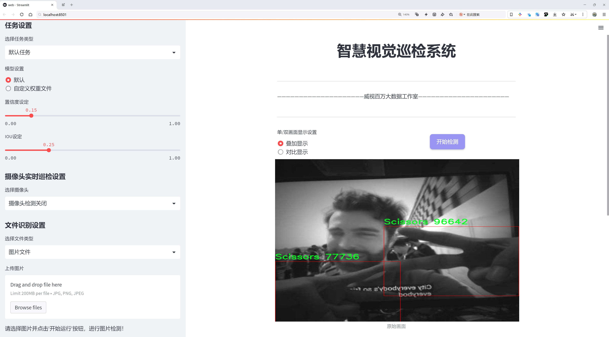
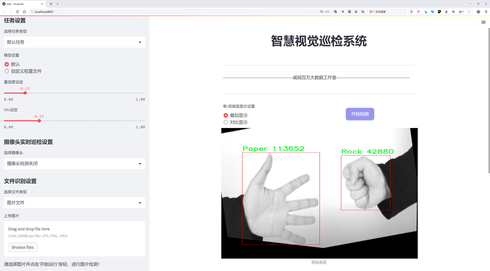
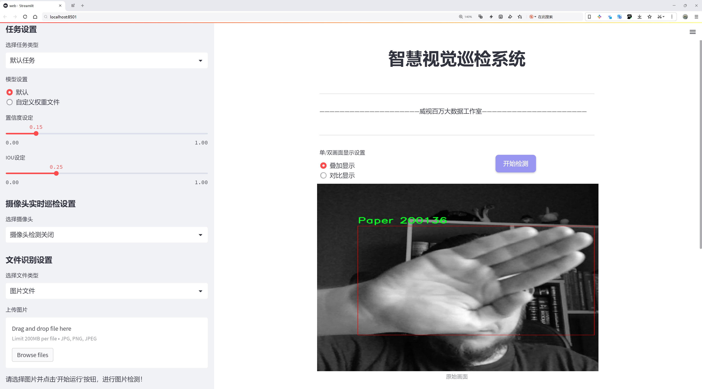
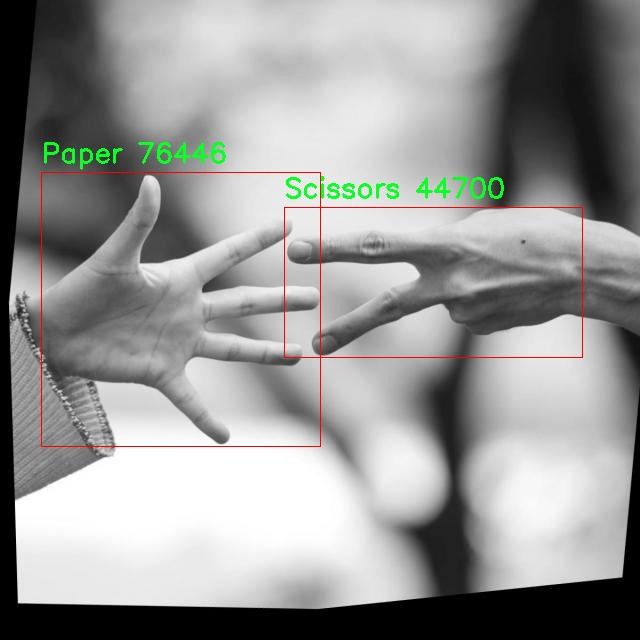
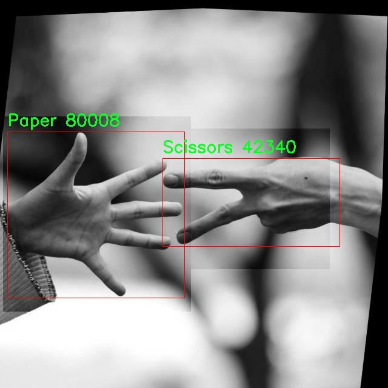
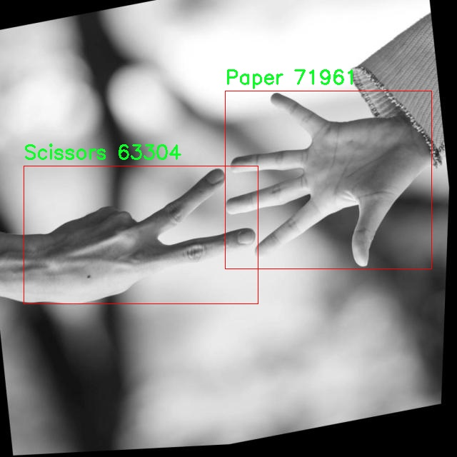
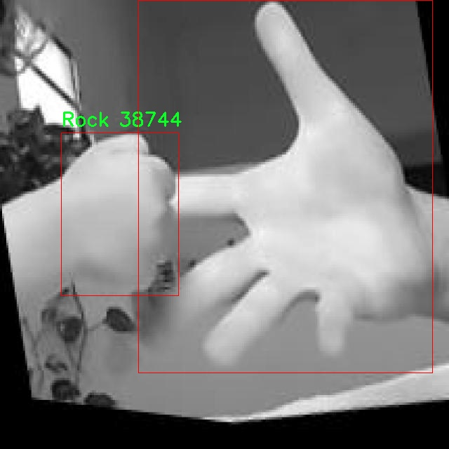
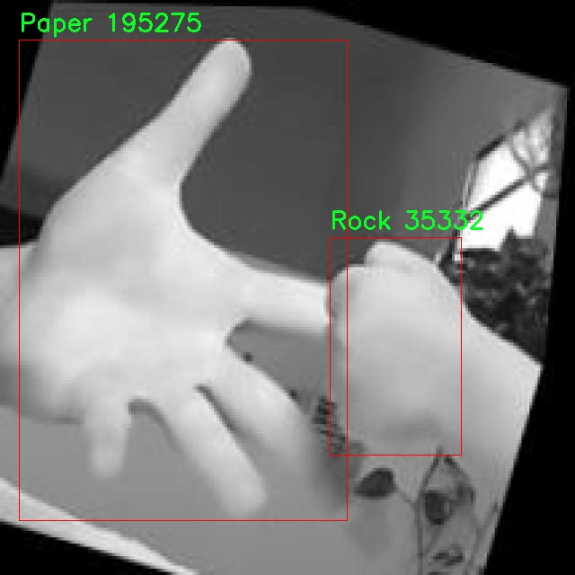

# 石头剪刀布手势识别检测系统源码分享
 # [一条龙教学YOLOV8标注好的数据集一键训练_70+全套改进创新点发刊_Web前端展示]

### 1.研究背景与意义

项目参考[AAAI Association for the Advancement of Artificial Intelligence](https://gitee.com/qunmasj/projects)

项目来源[AACV Association for the Advancement of Computer Vision](https://kdocs.cn/l/cszuIiCKVNis)

研究背景与意义

随着人工智能技术的迅猛发展，计算机视觉领域的研究逐渐成为了学术界和工业界的热点之一。手势识别作为计算机视觉的重要应用之一，已被广泛应用于人机交互、虚拟现实、增强现实等多个领域。特别是在智能家居、游戏控制以及机器人操作等场景中，手势识别技术的应用能够显著提升用户体验和操作效率。石头剪刀布作为一种简单而广泛流行的游戏，其手势识别不仅具有趣味性，还能够作为人机交互的有效方式。因此，基于改进YOLOv8的石头剪刀布手势识别系统的研究具有重要的学术价值和实际意义。

YOLO（You Only Look Once）系列模型因其高效的实时目标检测能力而受到广泛关注。YOLOv8作为该系列的最新版本，进一步提升了检测精度和速度，适用于多种复杂场景下的目标识别任务。然而，现有的YOLOv8模型在特定手势识别任务中的应用仍存在一定的局限性。为了实现对石头剪刀布手势的高效识别，针对YOLOv8进行改进和优化显得尤为重要。通过引入新的数据增强技术、优化网络结构以及调整超参数设置，可以显著提升模型在手势识别任务中的表现。

在本研究中，我们将利用一个包含3000张图像的手势数据集，数据集中包含三类手势：纸、石头和剪刀。这一数据集为手势识别提供了丰富的样本基础，使得模型能够在多样化的手势表现下进行有效学习。数据集的构建不仅考虑了图像数量的充足性，还注重了图像质量和多样性，以确保模型在不同环境和条件下的鲁棒性。通过对数据集的深入分析和处理，我们期望能够挖掘出手势识别中的潜在特征，从而为改进YOLOv8模型提供更为精准的训练数据。

此外，石头剪刀布手势识别系统的研究不仅限于学术探讨，其实际应用前景同样广阔。在游戏娱乐、教育培训、医疗康复等领域，手势识别技术的引入能够有效提升交互方式的多样性和趣味性。例如，在儿童教育中，通过手势识别游戏可以增强孩子们的学习兴趣；在医疗康复中，手势识别技术可以帮助患者进行康复训练。因此，基于改进YOLOv8的石头剪刀布手势识别系统的研究不仅具有理论意义，也为实际应用提供了可行的解决方案。

综上所述，基于改进YOLOv8的石头剪刀布手势识别系统的研究，既是对现有计算机视觉技术的深化探索，也是对手势识别应用潜力的挖掘。通过对模型的改进和数据集的优化，我们期待能够实现更高效、更准确的手势识别，为相关领域的技术发展和应用推广提供有力支持。

### 2.图片演示







##### 注意：由于此博客编辑较早，上面“2.图片演示”和“3.视频演示”展示的系统图片或者视频可能为老版本，新版本在老版本的基础上升级如下：（实际效果以升级的新版本为准）

  （1）适配了YOLOV8的“目标检测”模型和“实例分割”模型，通过加载相应的权重（.pt）文件即可自适应加载模型。

  （2）支持“图片识别”、“视频识别”、“摄像头实时识别”三种识别模式。

  （3）支持“图片识别”、“视频识别”、“摄像头实时识别”三种识别结果保存导出，解决手动导出（容易卡顿出现爆内存）存在的问题，识别完自动保存结果并导出到tempDir中。

  （4）支持Web前端系统中的标题、背景图等自定义修改，后面提供修改教程。

  另外本项目提供训练的数据集和训练教程,暂不提供权重文件（best.pt）,需要您按照教程进行训练后实现图片演示和Web前端界面演示的效果。

### 3.视频演示

[3.1 视频演示](https://www.bilibili.com/video/BV1mEsSeuER4/)

### 4.数据集信息展示

##### 4.1 本项目数据集详细数据（类别数＆类别名）

nc: 3
names: ['Paper', 'Rock', 'Scissors']


##### 4.2 本项目数据集信息介绍

数据集信息展示

在本研究中，我们采用了名为“paper”的数据集，以训练和改进YOLOv8模型，旨在提升石头剪刀布手势识别系统的准确性和鲁棒性。该数据集专门设计用于手势识别任务，包含三种主要类别，分别为“Paper”（纸）、“Rock”（石头）和“Scissors”（剪刀）。这三种手势是石头剪刀布游戏的基本元素，构成了该游戏的核心交互方式。通过对这些手势的有效识别，系统能够实现对玩家意图的快速响应，从而提升游戏体验和交互效率。

“paper”数据集的类别数量为3，涵盖了玩家在游戏中可能展示的所有手势。每个类别的样本均经过精心标注，确保在训练过程中，模型能够准确学习到每种手势的特征和变化。具体而言，“Paper”类别的样本展示了玩家用手掌打开的姿势，强调了手掌的平展和指尖的伸展；“Rock”类别则表现为拳头紧握的状态，突出了手的紧凑性和力量感；而“Scissors”类别则通过玩家的食指和中指张开，形成剪刀的形状，传达出灵活与敏捷的特征。

为了确保数据集的多样性和代表性，我们在收集样本时考虑了不同的光照条件、背景环境以及手势的表现方式。这种多样性使得模型在实际应用中能够更好地适应各种场景，减少因环境变化而导致的识别误差。此外，数据集中还包含了不同年龄、性别和肤色的参与者，进一步增强了模型的泛化能力，使其能够在不同用户群体中表现出色。

在数据预处理阶段，我们对图像进行了标准化处理，包括缩放、裁剪和旋转等操作，以确保输入数据的一致性和可比性。这些处理步骤不仅有助于提高模型的训练效率，还能有效降低过拟合的风险，使得模型在面对未见过的手势时依然能够保持较高的识别率。

在模型训练过程中，我们采用了数据增强技术，通过随机变换和扰动生成新的样本，以进一步丰富训练数据。这种方法不仅提高了模型的鲁棒性，还有效地扩展了数据集的规模，使得模型能够学习到更为丰富的手势特征。此外，我们还定期评估模型的性能，利用验证集监控训练过程中的准确率和损失值，确保模型的收敛性和稳定性。

综上所述，“paper”数据集为改进YOLOv8的石头剪刀布手势识别系统提供了坚实的基础。通过精心设计的类别和丰富的样本，数据集不仅提升了模型的学习效果，还为实际应用提供了可靠的支持。未来，我们期望通过不断优化数据集和模型，进一步推动手势识别技术的发展，为人机交互领域带来更多创新与突破。











### 5.全套项目环境部署视频教程（零基础手把手教学）

[5.1 环境部署教程链接（零基础手把手教学）](https://www.ixigua.com/7404473917358506534?logTag=c807d0cbc21c0ef59de5)


[5.2 安装Python虚拟环境创建和依赖库安装视频教程链接（零基础手把手教学）](https://www.ixigua.com/7404474678003106304?logTag=1f1041108cd1f708b01a)

### 6.手把手YOLOV8训练视频教程（零基础小白有手就能学会）

[6.1 手把手YOLOV8训练视频教程（零基础小白有手就能学会）](https://www.ixigua.com/7404477157818401292?logTag=d31a2dfd1983c9668658)

### 7.70+种全套YOLOV8创新点代码加载调参视频教程（一键加载写好的改进模型的配置文件）

[7.1 70+种全套YOLOV8创新点代码加载调参视频教程（一键加载写好的改进模型的配置文件）](https://www.ixigua.com/7404478314661806627?logTag=29066f8288e3f4eea3a4)

### 8.70+种全套YOLOV8创新点原理讲解（非科班也可以轻松写刊发刊，V10版本正在科研待更新）

由于篇幅限制，每个创新点的具体原理讲解就不一一展开，具体见下列网址中的创新点对应子项目的技术原理博客网址【Blog】：


[8.1 70+种全套YOLOV8创新点原理讲解链接](https://gitee.com/qunmasj/good)

### 9.系统功能展示（检测对象为举例，实际内容以本项目数据集为准）

图9.1.系统支持检测结果表格显示

  图9.2.系统支持置信度和IOU阈值手动调节

  图9.3.系统支持自定义加载权重文件best.pt(需要你通过步骤5中训练获得)

  图9.4.系统支持摄像头实时识别

  图9.5.系统支持图片识别

  图9.6.系统支持视频识别

  图9.7.系统支持识别结果文件自动保存

  图9.8.系统支持Excel导出检测结果数据


### 10.原始YOLOV8算法原理

原始YOLOv8算法原理

YOLOv8算法是目标检测领域的一个重要进展，继承了YOLO系列的优良传统，并在此基础上进行了多项创新和改进。作为YOLOv5的继任者，YOLOv8在设计上继续沿用了一系列高效的网络结构，同时引入了新的模块和技术，以提升检测精度和速度。该算法的整体架构主要由输入层、主干网络、特征融合层和解耦头组成，构成了一个高效的目标检测系统。

在YOLOv8的主干网络中，依然采用了CSPDarknet的设计理念，但对其进行了优化。具体来说，YOLOv8将YOLOv5中的C3模块替换为C2f模块，这一变更不仅实现了模型的轻量化，同时也保持了检测精度。C2f模块的设计灵感来源于YOLOv7的ELAN思想，其结构包含多个分支，通过这些分支可以有效地增强梯度流动，减轻深层网络中的梯度消失问题。C2f模块由多个CBS（卷积+归一化+SiLU激活）模块和若干个Bottleneck组成，能够提取更丰富的特征信息。

YOLOv8的特征融合层采用了PAN-FPN结构，这一结构的设计旨在充分融合多尺度特征信息。与YOLOv5相比，YOLOv8在上采样阶段去掉了1×1卷积，并对C3模块进行了替换，使得特征融合更加高效。通过这种方式，YOLOv8能够更好地结合浅层特征和深层特征，从而提高目标检测的准确性。

在检测头的设计上，YOLOv8引入了解耦头的概念，借鉴了YOLOX和YOLOv6的设计思路。解耦头将分类和回归任务分开处理，使得每个任务都可以独立优化。这一设计的好处在于，它可以更有效地利用特征图，提高检测精度。YOLOv8的检测头输出三个不同尺度的特征图，分别为80×80、40×40和20×20，这些特征图在后续的分类和边框回归中发挥了重要作用。

在损失函数的设计上，YOLOv8采用了VFLLoss作为分类损失，DFLLoss和CIoULoss作为回归损失。这些损失函数的设计旨在解决样本不平衡问题，尤其是在处理小目标时。VFLLoss通过对正负样本进行不对称加权，使得网络能够更加关注高质量的正样本，从而提升整体的检测性能。

此外，YOLOv8在样本匹配策略上也进行了创新。与YOLOv5的静态匹配策略不同，YOLOv8采用了Task-Aligned的Assigner匹配方式，这种动态匹配策略能够更好地适应不同数据集的特征，提高模型的泛化能力。通过这种方式，YOLOv8能够在多种场景下实现更为精准的目标检测。

在数据预处理方面，YOLOv8延续了YOLOv5的策略，采用了多种数据增强技术，包括马赛克增强、混合增强、空间扰动和颜色扰动等。这些增强手段的使用，能够有效提升模型的鲁棒性，使其在不同环境下均能保持良好的检测性能。

总的来说，YOLOv8算法通过对网络结构的优化、特征融合的增强、解耦头的引入以及损失函数的改进，成功地提升了目标检测的精度和速度。其在设计上的创新，使得YOLOv8不仅能够处理常规目标检测任务，还能在复杂场景中表现出色，成为目标检测领域的一个重要里程碑。随着YOLOv8的推出，目标检测技术的应用前景愈加广阔，尤其是在自动驾驶、安防监控和智能制造等领域，YOLOv8都展现出了强大的应用潜力。


### 11.项目核心源码讲解（再也不用担心看不懂代码逻辑）

#### 11.1 ui.py

以下是经过精简和注释的核心代码：

```python
import sys
import subprocess
from QtFusion.path import abs_path

def run_script(script_path):
    """
    使用当前 Python 环境运行指定的脚本。

    Args:
        script_path (str): 要运行的脚本路径
    """
    # 获取当前 Python 解释器的路径
    python_path = sys.executable

    # 构建运行命令，使用 streamlit 运行指定的脚本
    command = f'"{python_path}" -m streamlit run "{script_path}"'

    # 执行命令并等待其完成
    result = subprocess.run(command, shell=True)
    
    # 检查命令执行结果，如果返回码不为0，则表示出错
    if result.returncode != 0:
        print("脚本运行出错。")

# 主程序入口
if __name__ == "__main__":
    # 获取要运行的脚本的绝对路径
    script_path = abs_path("web.py")

    # 调用函数运行脚本
    run_script(script_path)
```

### 代码说明：
1. **导入模块**：
   - `sys`：用于获取当前 Python 解释器的路径。
   - `subprocess`：用于执行外部命令。
   - `abs_path`：从 `QtFusion.path` 导入的函数，用于获取文件的绝对路径。

2. **`run_script` 函数**：
   - 接受一个参数 `script_path`，表示要运行的 Python 脚本的路径。
   - 使用 `sys.executable` 获取当前 Python 解释器的路径。
   - 构建一个命令字符串，使用 `streamlit` 模块运行指定的脚本。
   - 使用 `subprocess.run` 执行命令，并等待其完成。
   - 检查命令的返回码，如果不为0，表示脚本运行出错，打印错误信息。

3. **主程序入口**：
   - 当脚本作为主程序运行时，获取 `web.py` 的绝对路径。
   - 调用 `run_script` 函数来执行该脚本。

这个文件是一个 Python 脚本，主要用于运行一个名为 `web.py` 的脚本。首先，它导入了一些必要的模块，包括 `sys`、`os` 和 `subprocess`，这些模块提供了与系统交互和执行外部命令的功能。此外，还导入了 `QtFusion.path` 模块中的 `abs_path` 函数，用于获取文件的绝对路径。

在文件中定义了一个名为 `run_script` 的函数，该函数接受一个参数 `script_path`，表示要运行的脚本的路径。函数内部首先获取当前 Python 解释器的路径，这样可以确保使用正确的 Python 环境来运行脚本。接着，构建一个命令字符串，该命令使用 `streamlit` 模块来运行指定的脚本。`streamlit` 是一个用于构建数据应用的库。

随后，使用 `subprocess.run` 方法执行构建好的命令。这个方法会在新的 shell 中运行命令，并等待其完成。如果命令执行的返回码不为零，表示脚本运行出错，程序会打印出相应的错误信息。

在文件的最后部分，使用 `if __name__ == "__main__":` 语句来确保只有在直接运行该脚本时才会执行后面的代码。这里指定了要运行的脚本路径为 `web.py`，并调用 `run_script` 函数来执行这个脚本。

总的来说，这个脚本的功能是启动一个基于 Streamlit 的 Web 应用，通过指定的脚本路径来运行相应的 Python 脚本。

#### 11.2 code\ultralytics\models\fastsam\utils.py

以下是经过简化和注释的核心代码部分：

```python
import torch

def adjust_bboxes_to_image_border(boxes, image_shape, threshold=20):
    """
    调整边界框，使其在距离图像边界一定阈值内时贴合边界。

    参数:
        boxes (torch.Tensor): 边界框的坐标，形状为 (n, 4)
        image_shape (tuple): 图像的高度和宽度，形状为 (height, width)
        threshold (int): 像素阈值，默认值为20

    返回:
        adjusted_boxes (torch.Tensor): 调整后的边界框
    """
    # 获取图像的高度和宽度
    h, w = image_shape

    # 调整边界框的坐标
    boxes[boxes[:, 0] < threshold, 0] = 0  # 左上角x坐标
    boxes[boxes[:, 1] < threshold, 1] = 0  # 左上角y坐标
    boxes[boxes[:, 2] > w - threshold, 2] = w  # 右下角x坐标
    boxes[boxes[:, 3] > h - threshold, 3] = h  # 右下角y坐标
    return boxes

def bbox_iou(box1, boxes, iou_thres=0.9, image_shape=(640, 640), raw_output=False):
    """
    计算一个边界框与其他边界框的交并比（IoU）。

    参数:
        box1 (torch.Tensor): 单个边界框的坐标，形状为 (4, )
        boxes (torch.Tensor): 一组边界框的坐标，形状为 (n, 4)
        iou_thres (float): IoU阈值，默认值为0.9
        image_shape (tuple): 图像的高度和宽度，形状为 (height, width)
        raw_output (bool): 如果为True，返回原始IoU值而不是索引

    返回:
        high_iou_indices (torch.Tensor): IoU大于阈值的边界框索引
    """
    # 调整边界框以贴合图像边界
    boxes = adjust_bboxes_to_image_border(boxes, image_shape)

    # 计算交集的坐标
    x1 = torch.max(box1[0], boxes[:, 0])  # 交集左上角x坐标
    y1 = torch.max(box1[1], boxes[:, 1])  # 交集左上角y坐标
    x2 = torch.min(box1[2], boxes[:, 2])  # 交集右下角x坐标
    y2 = torch.min(box1[3], boxes[:, 3])  # 交集右下角y坐标

    # 计算交集的面积
    intersection = (x2 - x1).clamp(0) * (y2 - y1).clamp(0)

    # 计算每个边界框的面积
    box1_area = (box1[2] - box1[0]) * (box1[3] - box1[1])  # box1的面积
    box2_area = (boxes[:, 2] - boxes[:, 0]) * (boxes[:, 3] - boxes[:, 1])  # boxes的面积

    # 计算并集的面积
    union = box1_area + box2_area - intersection

    # 计算IoU
    iou = intersection / union  # IoU值，形状为 (n, )
    
    if raw_output:
        return 0 if iou.numel() == 0 else iou  # 如果需要原始IoU值，直接返回

    # 返回IoU大于阈值的边界框索引
    return torch.nonzero(iou > iou_thres).flatten()
```

### 代码注释说明：
1. **adjust_bboxes_to_image_border** 函数用于调整边界框的位置，使其在接近图像边界时，能够贴合边界，避免超出图像范围。
2. **bbox_iou** 函数计算一个边界框与一组边界框之间的交并比（IoU），并根据设定的阈值返回满足条件的边界框索引。该函数首先调用 `adjust_bboxes_to_image_border` 来确保所有边界框都在图像范围内，然后计算交集和并集的面积，最终计算IoU值。

这个程序文件是一个用于处理目标检测中边界框（bounding boxes）的工具模块，主要包含两个函数：`adjust_bboxes_to_image_border` 和 `bbox_iou`。文件中使用了 PyTorch 库来进行张量操作。

`adjust_bboxes_to_image_border` 函数的作用是调整给定的边界框，使其在接近图像边界时能够“粘附”到图像边缘。函数接收三个参数：`boxes` 是一个形状为 (n, 4) 的张量，表示 n 个边界框的坐标；`image_shape` 是一个元组，包含图像的高度和宽度；`threshold` 是一个整数，表示允许的像素阈值。函数首先获取图像的高度和宽度，然后根据阈值调整边界框的坐标。如果边界框的左上角坐标（x1, y1）小于阈值，则将其调整为 0；如果右下角坐标（x2, y2）超过图像边界减去阈值，则将其调整为图像的宽度或高度。最后，函数返回调整后的边界框。

`bbox_iou` 函数用于计算一个边界框与一组其他边界框之间的交并比（IoU，Intersection over Union）。该函数接受多个参数：`box1` 是一个形状为 (4,) 的张量，表示要计算的边界框；`boxes` 是一个形状为 (n, 4) 的张量，表示其他边界框；`iou_thres` 是一个浮点数，表示 IoU 的阈值；`image_shape` 是图像的高度和宽度；`raw_output` 是一个布尔值，指示是否返回原始的 IoU 值。函数首先调用 `adjust_bboxes_to_image_border` 来调整边界框，然后计算交集的坐标，进而计算交集的面积。接着，计算两个边界框的面积，并根据交集和并集的面积计算 IoU 值。如果 `raw_output` 为真，函数将返回 IoU 值；否则，返回 IoU 大于阈值的边界框的索引。

整体来看，这个模块提供了处理边界框的基本功能，适用于目标检测任务中的边界框调整和相似度计算。

#### 11.3 code\ultralytics\solutions\distance_calculation.py

以下是代码中最核心的部分，并附上详细的中文注释：

```python
import math
import cv2
from ultralytics.utils.checks import check_imshow
from ultralytics.utils.plotting import Annotator, colors

class DistanceCalculation:
    """一个用于实时视频流中计算两个物体之间距离的类。"""

    def __init__(self):
        """初始化距离计算类，设置默认的视觉、图像、跟踪和距离参数。"""
        self.im0 = None  # 存储当前帧图像
        self.annotator = None  # 用于绘制标注的对象
        self.view_img = False  # 是否显示图像
        self.line_color = (255, 255, 0)  # 线条颜色
        self.centroid_color = (255, 0, 255)  # 中心点颜色

        self.clss = None  # 物体类别
        self.names = None  # 物体名称
        self.boxes = None  # 物体边界框
        self.line_thickness = 2  # 边界框线条厚度
        self.trk_ids = None  # 跟踪ID

        self.centroids = []  # 存储中心点
        self.pixel_per_meter = 10  # 像素与米的比例

        self.left_mouse_count = 0  # 左键点击计数
        self.selected_boxes = {}  # 存储选中的边界框

        # 检查环境是否支持imshow
        self.env_check = check_imshow(warn=True)

    def extract_tracks(self, tracks):
        """
        从提供的数据中提取结果。

        Args:
            tracks (list): 从物体跟踪过程中获得的轨迹列表。
        """
        self.boxes = tracks[0].boxes.xyxy.cpu()  # 获取边界框坐标
        self.clss = tracks[0].boxes.cls.cpu().tolist()  # 获取物体类别
        self.trk_ids = tracks[0].boxes.id.int().cpu().tolist()  # 获取跟踪ID

    def calculate_centroid(self, box):
        """
        计算边界框的中心点。

        Args:
            box (list): 边界框数据
        """
        return int((box[0] + box[2]) // 2), int((box[1] + box[3]) // 2)

    def calculate_distance(self, centroid1, centroid2):
        """
        计算两个中心点之间的距离。

        Args:
            centroid1 (point): 第一个中心点
            centroid2 (point): 第二个中心点
        """
        pixel_distance = math.sqrt((centroid1[0] - centroid2[0]) ** 2 + (centroid1[1] - centroid2[1]) ** 2)
        return pixel_distance / self.pixel_per_meter  # 将像素距离转换为米

    def plot_distance_and_line(self, distance):
        """
        在帧上绘制距离和线条。

        Args:
            distance (float): 两个中心点之间的距离
        """
        cv2.rectangle(self.im0, (15, 25), (280, 70), (255, 255, 255), -1)  # 绘制背景矩形
        cv2.putText(
            self.im0, f"Distance : {distance:.2f}m", (20, 55), cv2.FONT_HERSHEY_SIMPLEX, 0.8, (0, 0, 0), 2, cv2.LINE_AA
        )  # 显示距离文本
        cv2.line(self.im0, self.centroids[0], self.centroids[1], self.line_color, 3)  # 绘制连接线
        cv2.circle(self.im0, self.centroids[0], 6, self.centroid_color, -1)  # 绘制第一个中心点
        cv2.circle(self.im0, self.centroids[1], 6, self.centroid_color, -1)  # 绘制第二个中心点

    def start_process(self, im0, tracks):
        """
        根据跟踪数据计算两个边界框之间的距离。

        Args:
            im0 (nd array): 图像
            tracks (list): 从物体跟踪过程中获得的轨迹列表。
        """
        self.im0 = im0  # 设置当前帧图像
        if tracks[0].boxes.id is None:  # 如果没有检测到物体
            if self.view_img:
                self.display_frames()  # 显示帧
            return
        
        self.extract_tracks(tracks)  # 提取跟踪数据

        self.annotator = Annotator(self.im0, line_width=2)  # 初始化Annotator

        # 遍历每个边界框，绘制标注
        for box, cls, track_id in zip(self.boxes, self.clss, self.trk_ids):
            self.annotator.box_label(box, color=colors(int(cls), True), label=self.names[int(cls)])

            # 如果选中了两个边界框，更新选中的边界框
            if len(self.selected_boxes) == 2:
                for trk_id, _ in self.selected_boxes.items():
                    if trk_id == track_id:
                        self.selected_boxes[track_id] = box

        # 如果选中了两个边界框，计算距离并绘制
        if len(self.selected_boxes) == 2:
            for trk_id, box in self.selected_boxes.items():
                centroid = self.calculate_centroid(self.selected_boxes[trk_id])  # 计算中心点
                self.centroids.append(centroid)

            distance = self.calculate_distance(self.centroids[0], self.centroids[1])  # 计算距离
            self.plot_distance_and_line(distance)  # 绘制距离和线条

        self.centroids = []  # 清空中心点列表

        if self.view_img and self.env_check:
            self.display_frames()  # 显示帧

        return im0

    def display_frames(self):
        """显示帧。"""
        cv2.namedWindow("Ultralytics Distance Estimation")  # 创建窗口
        cv2.imshow("Ultralytics Distance Estimation", self.im0)  # 显示图像

        if cv2.waitKey(1) & 0xFF == ord("q"):  # 按下'q'键退出
            return

if __name__ == "__main__":
    DistanceCalculation()  # 实例化距离计算类
```

### 代码核心部分说明：
1. **DistanceCalculation类**：用于处理视频流中的物体检测和距离计算。
2. **extract_tracks方法**：从跟踪数据中提取边界框、类别和跟踪ID。
3. **calculate_centroid方法**：计算给定边界框的中心点。
4. **calculate_distance方法**：计算两个中心点之间的距离，并将其转换为米。
5. **plot_distance_and_line方法**：在图像上绘制距离信息和连接线。
6. **start_process方法**：主处理逻辑，提取跟踪数据，计算距离并更新图像显示。
7. **display_frames方法**：显示处理后的图像并处理退出事件。

这个程序文件是一个用于实时视频流中计算两个物体之间距离的类，名为 `DistanceCalculation`。它利用计算机视觉技术，结合物体跟踪和鼠标事件，来实现对物体距离的动态测量。

在类的初始化方法 `__init__` 中，设置了一些默认参数，包括图像信息、预测跟踪信息、距离计算信息和鼠标事件的处理。`self.im0` 用于存储当前帧图像，`self.annotator` 用于绘制标注，`self.centroids` 则用于存储选中物体的质心坐标。`self.pixel_per_meter` 是一个重要参数，用于将像素距离转换为实际距离，默认为10像素对应1米。

`set_args` 方法用于配置距离计算和显示参数，接受多个参数，包括物体类别名称、每米的像素数、是否显示图像、线条厚度和颜色等。这些参数可以根据实际需求进行调整。

`mouse_event_for_distance` 方法处理鼠标事件，允许用户通过左键选择两个物体的边界框，并通过右键重置选择。每当用户点击左键时，程序会检查鼠标位置是否在物体的边界框内，如果是，则将该物体的跟踪ID和边界框存储到 `selected_boxes` 字典中。

`extract_tracks` 方法从跟踪数据中提取边界框、类别和跟踪ID信息。`calculate_centroid` 方法计算给定边界框的质心坐标，而 `calculate_distance` 方法则根据两个质心之间的像素距离计算实际距离，使用了简单的欧几里得距离公式。

`plot_distance_and_line` 方法在图像上绘制两个物体之间的距离和连接线，显示在图像的左上角。它使用 OpenCV 的绘图函数来实现这些效果。

`start_process` 方法是主要的处理逻辑，它接收当前帧图像和跟踪数据，提取相关信息并进行距离计算。如果选中了两个物体，程序会计算它们的质心，并调用 `calculate_distance` 方法获取实际距离，最后通过 `plot_distance_and_line` 方法在图像上显示结果。

`display_frames` 方法用于显示处理后的图像，并设置鼠标回调函数，以便用户可以与图像进行交互。程序会持续显示图像，直到用户按下 'q' 键退出。

最后，文件的主程序部分创建了 `DistanceCalculation` 类的实例，启动了整个距离计算的过程。整体来看，这个程序结合了计算机视觉和用户交互，为实时视频流中的物体距离测量提供了一个有效的解决方案。

#### 11.4 code\ultralytics\utils\autobatch.py

以下是代码中最核心的部分，并附上详细的中文注释：

```python
import numpy as np
import torch
from ultralytics.utils import LOGGER, colorstr
from ultralytics.utils.torch_utils import profile

def autobatch(model, imgsz=640, fraction=0.60, batch_size=16):
    """
    自动估计最佳的YOLO批处理大小，以使用可用CUDA内存的一部分。

    参数:
        model (torch.nn.Module): 要计算批处理大小的YOLO模型。
        imgsz (int, optional): 用作YOLO模型输入的图像大小。默认为640。
        fraction (float, optional): 要使用的可用CUDA内存的比例。默认为0.60。
        batch_size (int, optional): 如果检测到错误时使用的默认批处理大小。默认为16。

    返回:
        (int): 最优批处理大小。
    """

    # 检查设备
    prefix = colorstr("AutoBatch: ")
    LOGGER.info(f"{prefix}计算图像大小为 {imgsz} 的最优批处理大小")
    device = next(model.parameters()).device  # 获取模型所在设备
    if device.type == "cpu":
        LOGGER.info(f"{prefix}未检测到CUDA，使用默认CPU批处理大小 {batch_size}")
        return batch_size
    if torch.backends.cudnn.benchmark:
        LOGGER.info(f"{prefix} ⚠️ 需要将 torch.backends.cudnn.benchmark 设置为 False，使用默认批处理大小 {batch_size}")
        return batch_size

    # 检查CUDA内存
    gb = 1 << 30  # 字节转GiB (1024 ** 3)
    properties = torch.cuda.get_device_properties(device)  # 获取设备属性
    t = properties.total_memory / gb  # GiB 总内存
    r = torch.cuda.memory_reserved(device) / gb  # GiB 保留内存
    a = torch.cuda.memory_allocated(device) / gb  # GiB 已分配内存
    f = t - (r + a)  # GiB 可用内存
    LOGGER.info(f"{prefix}{device} ({properties.name}) {t:.2f}G 总内存, {r:.2f}G 保留内存, {a:.2f}G 已分配内存, {f:.2f}G 可用内存")

    # 评估批处理大小
    batch_sizes = [1, 2, 4, 8, 16]  # 测试的批处理大小
    try:
        img = [torch.empty(b, 3, imgsz, imgsz) for b in batch_sizes]  # 创建空图像张量
        results = profile(img, model, n=3, device=device)  # 评估每个批处理大小的性能

        # 拟合解决方案
        y = [x[2] for x in results if x]  # 提取内存使用情况
        p = np.polyfit(batch_sizes[: len(y)], y, deg=1)  # 一次多项式拟合
        b = int((f * fraction - p[1]) / p[0])  # 计算最佳批处理大小
        if None in results:  # 如果某些大小失败
            i = results.index(None)  # 找到第一个失败的索引
            if b >= batch_sizes[i]:  # 如果最佳大小在失败点之上
                b = batch_sizes[max(i - 1, 0)]  # 选择前一个安全点
        if b < 1 or b > 1024:  # 如果最佳大小超出安全范围
            b = batch_size
            LOGGER.info(f"{prefix}警告 ⚠️ 检测到CUDA异常，使用默认批处理大小 {batch_size}.")

        fraction = (np.polyval(p, b) + r + a) / t  # 预测的实际内存使用比例
        LOGGER.info(f"{prefix}为 {device} 使用批处理大小 {b} {t * fraction:.2f}G/{t:.2f}G ({fraction * 100:.0f}%) ✅")
        return b
    except Exception as e:
        LOGGER.warning(f"{prefix}警告 ⚠️ 检测到错误: {e}, 使用默认批处理大小 {batch_size}.")
        return batch_size
```

### 代码核心部分解释：
1. **导入必要的库**：导入 `numpy` 和 `torch`，以及一些工具函数和日志记录功能。
2. **`autobatch` 函数**：该函数用于自动估计最佳的批处理大小，以充分利用可用的CUDA内存。
   - **参数说明**：包括模型、图像大小、内存使用比例和默认批处理大小。
   - **设备检查**：检查模型所在的设备类型，如果是CPU则返回默认批处理大小。
   - **CUDA内存检查**：获取CUDA设备的总内存、保留内存和已分配内存，计算可用内存。
   - **批处理大小评估**：创建不同批处理大小的空图像，使用 `profile` 函数评估每个批处理大小的性能，并拟合内存使用情况。
   - **返回最佳批处理大小**：根据拟合结果和可用内存计算最佳批处理大小，并进行安全性检查。

这个程序文件是用于在PyTorch中估算最佳YOLO模型批处理大小的工具，目的是使得训练过程中使用的CUDA内存占用在可用内存的一定比例内。文件中包含了几个主要的函数和逻辑，下面是对其代码的详细讲解。

首先，文件导入了一些必要的库，包括`deepcopy`用于深拷贝模型，`numpy`用于数值计算，`torch`用于深度学习框架的操作，以及一些来自`ultralytics`的工具函数和常量。

`check_train_batch_size`函数的作用是检查给定YOLO模型的训练批处理大小。它接受三个参数：模型、图像大小和一个布尔值表示是否使用自动混合精度（AMP）。在这个函数中，模型会被深拷贝并设置为训练模式，然后调用`autobatch`函数来计算最佳批处理大小。

`autobatch`函数是核心功能，它自动估算最佳的YOLO批处理大小。该函数接受四个参数：模型、图像大小、使用的CUDA内存比例（默认为60%）和默认批处理大小（默认为16）。首先，它会检查模型所在的设备，如果是CPU，则直接返回默认的批处理大小。如果CUDA环境不符合要求（如`torch.backends.cudnn.benchmark`为True），也会返回默认值。

接下来，函数会检查CUDA内存的使用情况，包括总内存、已保留内存和已分配内存，并计算出可用的自由内存。通过日志记录这些信息，便于用户了解当前的CUDA内存状态。

然后，函数会对几个预设的批处理大小（1, 2, 4, 8, 16）进行性能分析。它创建了一个空的张量列表，代表不同批处理大小的输入图像，并调用`profile`函数来获取每个批处理大小的内存使用情况。通过对结果进行线性拟合，计算出最佳的批处理大小。

在计算过程中，如果发现某个批处理大小导致了错误，函数会回退到之前的安全点。如果计算出的批处理大小不在合理范围内（小于1或大于1024），则会使用默认的批处理大小，并记录警告信息。

最后，函数会记录使用的批处理大小及其对应的CUDA内存占用比例，并返回该批处理大小。如果在执行过程中发生异常，函数会捕获异常并返回默认的批处理大小，同时记录警告信息。

总体而言，这个文件提供了一种动态调整YOLO模型训练批处理大小的方法，以便在不超出CUDA内存限制的情况下，优化训练过程的效率。

#### 11.5 code\ultralytics\models\sam\modules\decoders.py

以下是经过简化并添加详细中文注释的核心代码部分：

```python
import torch
from torch import nn
from torch.nn import functional as F
from ultralytics.nn.modules import LayerNorm2d

class MaskDecoder(nn.Module):
    """
    MaskDecoder类用于生成图像的掩码及其质量评分，采用变换器架构来预测掩码。
    """

    def __init__(self, transformer_dim: int, transformer: nn.Module, num_multimask_outputs: int = 3) -> None:
        """
        初始化MaskDecoder类。

        参数:
            transformer_dim (int): 变换器模块的通道维度。
            transformer (nn.Module): 用于预测掩码的变换器模块。
            num_multimask_outputs (int): 预测的掩码数量，用于区分不同的掩码。
        """
        super().__init__()
        self.transformer_dim = transformer_dim  # 变换器的通道维度
        self.transformer = transformer  # 变换器模块

        self.num_multimask_outputs = num_multimask_outputs  # 多掩码输出数量

        # IoU token的嵌入层
        self.iou_token = nn.Embedding(1, transformer_dim)
        # 掩码token的数量
        self.num_mask_tokens = num_multimask_outputs + 1
        # 掩码token的嵌入层
        self.mask_tokens = nn.Embedding(self.num_mask_tokens, transformer_dim)

        # 输出上采样网络
        self.output_upscaling = nn.Sequential(
            nn.ConvTranspose2d(transformer_dim, transformer_dim // 4, kernel_size=2, stride=2),
            LayerNorm2d(transformer_dim // 4),
            nn.GELU(),  # 激活函数
            nn.ConvTranspose2d(transformer_dim // 4, transformer_dim // 8, kernel_size=2, stride=2),
            nn.GELU(),  # 激活函数
        )
        
        # 生成掩码的超网络MLP
        self.output_hypernetworks_mlps = nn.ModuleList(
            [MLP(transformer_dim, transformer_dim, transformer_dim // 8, 3) for _ in range(self.num_mask_tokens)]
        )

        # 预测掩码质量的MLP
        self.iou_prediction_head = MLP(transformer_dim, 256, self.num_mask_tokens, 3)

    def forward(self, image_embeddings: torch.Tensor, image_pe: torch.Tensor, sparse_prompt_embeddings: torch.Tensor, dense_prompt_embeddings: torch.Tensor, multimask_output: bool) -> Tuple[torch.Tensor, torch.Tensor]:
        """
        预测掩码。

        参数:
            image_embeddings (torch.Tensor): 图像编码器的嵌入。
            image_pe (torch.Tensor): 图像嵌入的位置信息。
            sparse_prompt_embeddings (torch.Tensor): 稀疏提示的嵌入。
            dense_prompt_embeddings (torch.Tensor): 密集提示的嵌入。
            multimask_output (bool): 是否返回多个掩码。

        返回:
            torch.Tensor: 预测的掩码。
            torch.Tensor: 掩码质量的预测。
        """
        # 预测掩码和IoU
        masks, iou_pred = self.predict_masks(image_embeddings, image_pe, sparse_prompt_embeddings, dense_prompt_embeddings)

        # 根据是否需要多个掩码选择输出
        mask_slice = slice(1, None) if multimask_output else slice(0, 1)
        masks = masks[:, mask_slice, :, :]
        iou_pred = iou_pred[:, mask_slice]

        return masks, iou_pred

    def predict_masks(self, image_embeddings: torch.Tensor, image_pe: torch.Tensor, sparse_prompt_embeddings: torch.Tensor, dense_prompt_embeddings: torch.Tensor) -> Tuple[torch.Tensor, torch.Tensor]:
        """
        预测掩码的具体实现。

        参数:
            image_embeddings (torch.Tensor): 图像编码器的嵌入。
            image_pe (torch.Tensor): 图像嵌入的位置信息。
            sparse_prompt_embeddings (torch.Tensor): 稀疏提示的嵌入。
            dense_prompt_embeddings (torch.Tensor): 密集提示的嵌入。

        返回:
            torch.Tensor: 预测的掩码。
            torch.Tensor: 掩码质量的预测。
        """
        # 连接输出token
        output_tokens = torch.cat([self.iou_token.weight, self.mask_tokens.weight], dim=0)
        output_tokens = output_tokens.unsqueeze(0).expand(sparse_prompt_embeddings.size(0), -1, -1)
        tokens = torch.cat((output_tokens, sparse_prompt_embeddings), dim=1)

        # 扩展每个图像的数据以适应每个掩码
        src = torch.repeat_interleave(image_embeddings, tokens.shape[0], dim=0)
        src = src + dense_prompt_embeddings
        pos_src = torch.repeat_interleave(image_pe, tokens.shape[0], dim=0)

        # 运行变换器
        hs, src = self.transformer(src, pos_src, tokens)
        iou_token_out = hs[:, 0, :]  # IoU token的输出
        mask_tokens_out = hs[:, 1 : (1 + self.num_mask_tokens), :]  # 掩码token的输出

        # 上采样掩码嵌入并预测掩码
        src = src.transpose(1, 2).view(src.shape[0], src.shape[1], -1)
        upscaled_embedding = self.output_upscaling(src)
        hyper_in_list: List[torch.Tensor] = [
            self.output_hypernetworks_mlps[i](mask_tokens_out[:, i, :]) for i in range(self.num_mask_tokens)
        ]
        hyper_in = torch.stack(hyper_in_list, dim=1)
        masks = (hyper_in @ upscaled_embedding.view(upscaled_embedding.shape[0], upscaled_embedding.shape[1], -1)).view(upscaled_embedding.shape[0], -1, upscaled_embedding.shape[2], upscaled_embedding.shape[3])

        # 生成掩码质量预测
        iou_pred = self.iou_prediction_head(iou_token_out)

        return masks, iou_pred

class MLP(nn.Module):
    """
    MLP（多层感知器）模型。
    """

    def __init__(self, input_dim: int, hidden_dim: int, output_dim: int, num_layers: int) -> None:
        """
        初始化MLP模型。

        参数:
            input_dim (int): 输入特征的维度。
            hidden_dim (int): 隐藏层的维度。
            output_dim (int): 输出层的维度。
            num_layers (int): 隐藏层的数量。
        """
        super().__init__()
        self.layers = nn.ModuleList(
            nn.Linear(n, k) for n, k in zip([input_dim] + [hidden_dim] * (num_layers - 1), [hidden_dim] * (num_layers - 1) + [output_dim])
        )

    def forward(self, x):
        """执行前向传播并应用激活函数。"""
        for i, layer in enumerate(self.layers):
            x = F.relu(layer(x)) if i < len(self.layers) - 1 else layer(x)  # 最后一层不应用ReLU
        return x
```

### 代码说明：
1. **MaskDecoder类**：用于生成图像的掩码和质量评分，使用变换器架构。
   - **初始化方法**：设置变换器的维度、嵌入层、上采样网络和预测头。
   - **forward方法**：接收图像和提示的嵌入，预测掩码和质量。
   - **predict_masks方法**：具体实现掩码的预测逻辑，包括连接token、运行变换器和生成掩码。

2. **MLP类**：多层感知器模型，用于生成掩码质量评分。
   - **初始化方法**：设置输入、隐藏和输出层的维度。
   - **forward方法**：执行前向传播，应用激活函数。

这个程序文件定义了一个名为 `MaskDecoder` 的类，主要用于生成图像的掩码以及相关的质量评分。它采用了变换器（transformer）架构，通过图像和提示嵌入来预测掩码。该类的构造函数接收多个参数，包括变换器的维度、变换器模块、输出掩码的数量、激活函数类型等，并初始化了一些必要的属性。

在 `__init__` 方法中，首先调用父类的构造函数，然后设置了一些类属性，例如 `transformer_dim` 和 `transformer`。接着，定义了用于生成掩码的嵌入层，包括 IoU（Intersection over Union）令牌和掩码令牌的嵌入。输出上采样的过程通过一个序列的卷积转置层和层归一化来实现，最后定义了用于生成掩码的超网络 MLP（多层感知器）和用于预测掩码质量的 MLP。

`forward` 方法是该类的主要功能入口，它接收图像嵌入、位置编码、稀疏和密集的提示嵌入，以及一个布尔值来指示是否返回多个掩码。该方法调用 `predict_masks` 函数来生成掩码和 IoU 预测，然后根据 `multimask_output` 的值选择输出的掩码和质量预测。

`predict_masks` 方法负责具体的掩码预测过程。它首先将 IoU 令牌和掩码令牌的嵌入进行拼接，并扩展到每个图像的批次中。接着，图像嵌入和密集提示嵌入被加在一起，形成输入源。然后，将这些输入传递给变换器进行处理，得到输出的掩码令牌和 IoU 令牌的输出。接下来，通过上采样和超网络 MLP 生成最终的掩码，并使用 IoU 预测头生成掩码质量的预测。

此外，文件中还定义了一个 `MLP` 类，用于构建多层感知器模型。该类的构造函数接收输入维度、隐藏层维度、输出维度和层数等参数，并初始化一系列线性层。`forward` 方法实现了前向传播，依次通过每一层，并在最后一层应用激活函数（如果需要的话）。

总体而言，这个文件实现了一个复杂的掩码生成模块，结合了深度学习中的变换器架构和多层感知器，用于处理图像分割任务。

#### 11.6 train.py

以下是代码中最核心的部分，并附上详细的中文注释：

```python
class DetectionTrainer(BaseTrainer):
    """
    DetectionTrainer类，继承自BaseTrainer类，用于基于检测模型的训练。
    """

    def build_dataset(self, img_path, mode="train", batch=None):
        """
        构建YOLO数据集。

        参数:
            img_path (str): 包含图像的文件夹路径。
            mode (str): 模式，可以是'train'或'val'，用户可以为每种模式自定义不同的增强。
            batch (int, optional): 批次大小，仅用于'rect'模式。默认为None。
        """
        gs = max(int(de_parallel(self.model).stride.max() if self.model else 0), 32)
        return build_yolo_dataset(self.args, img_path, batch, self.data, mode=mode, rect=mode == "val", stride=gs)

    def get_dataloader(self, dataset_path, batch_size=16, rank=0, mode="train"):
        """构造并返回数据加载器。"""
        assert mode in ["train", "val"]  # 确保模式是'train'或'val'
        with torch_distributed_zero_first(rank):  # 在分布式训练中，确保数据集只初始化一次
            dataset = self.build_dataset(dataset_path, mode, batch_size)  # 构建数据集
        shuffle = mode == "train"  # 训练模式下打乱数据
        if getattr(dataset, "rect", False) and shuffle:
            LOGGER.warning("WARNING ⚠️ 'rect=True'与DataLoader的shuffle不兼容，设置shuffle=False")
            shuffle = False
        workers = self.args.workers if mode == "train" else self.args.workers * 2  # 根据模式设置工作线程数
        return build_dataloader(dataset, batch_size, workers, shuffle, rank)  # 返回数据加载器

    def preprocess_batch(self, batch):
        """对一批图像进行预处理，包括缩放和转换为浮点数。"""
        batch["img"] = batch["img"].to(self.device, non_blocking=True).float() / 255  # 将图像转换为浮点数并归一化
        if self.args.multi_scale:  # 如果启用多尺度
            imgs = batch["img"]
            sz = (
                random.randrange(self.args.imgsz * 0.5, self.args.imgsz * 1.5 + self.stride)
                // self.stride
                * self.stride
            )  # 随机选择一个尺寸
            sf = sz / max(imgs.shape[2:])  # 计算缩放因子
            if sf != 1:  # 如果缩放因子不为1
                ns = [
                    math.ceil(x * sf / self.stride) * self.stride for x in imgs.shape[2:]
                ]  # 计算新的形状
                imgs = nn.functional.interpolate(imgs, size=ns, mode="bilinear", align_corners=False)  # 进行插值缩放
            batch["img"] = imgs  # 更新批次图像
        return batch

    def set_model_attributes(self):
        """设置模型的属性，包括类别数量和名称。"""
        self.model.nc = self.data["nc"]  # 将类别数量附加到模型
        self.model.names = self.data["names"]  # 将类别名称附加到模型
        self.model.args = self.args  # 将超参数附加到模型

    def get_model(self, cfg=None, weights=None, verbose=True):
        """返回YOLO检测模型。"""
        model = DetectionModel(cfg, nc=self.data["nc"], verbose=verbose and RANK == -1)  # 创建检测模型
        if weights:
            model.load(weights)  # 加载权重
        return model

    def get_validator(self):
        """返回YOLO模型验证器。"""
        self.loss_names = "box_loss", "cls_loss", "dfl_loss"  # 定义损失名称
        return yolo.detect.DetectionValidator(
            self.test_loader, save_dir=self.save_dir, args=copy(self.args), _callbacks=self.callbacks
        )

    def plot_training_samples(self, batch, ni):
        """绘制带有注释的训练样本。"""
        plot_images(
            images=batch["img"],
            batch_idx=batch["batch_idx"],
            cls=batch["cls"].squeeze(-1),
            bboxes=batch["bboxes"],
            paths=batch["im_file"],
            fname=self.save_dir / f"train_batch{ni}.jpg",
            on_plot=self.on_plot,
        )
```

### 代码说明
1. **DetectionTrainer类**：该类用于训练YOLO检测模型，继承自BaseTrainer类，包含构建数据集、获取数据加载器、预处理批次、设置模型属性等方法。
2. **build_dataset方法**：构建YOLO数据集，支持训练和验证模式，允许用户自定义增强。
3. **get_dataloader方法**：构造数据加载器，支持分布式训练，确保数据集只初始化一次。
4. **preprocess_batch方法**：对输入的图像批次进行预处理，包括归一化和多尺度处理。
5. **set_model_attributes方法**：设置模型的类别数量和名称，确保模型与数据集一致。
6. **get_model方法**：返回YOLO检测模型，可以加载预训练权重。
7. **get_validator方法**：返回用于验证模型的验证器，定义损失名称。
8. **plot_training_samples方法**：绘制训练样本及其注释，便于可视化训练过程。

这个程序文件 `train.py` 是一个用于训练目标检测模型的脚本，特别是基于 YOLO（You Only Look Once）架构的模型。文件中定义了一个名为 `DetectionTrainer` 的类，该类继承自 `BaseTrainer`，并实现了一系列用于构建数据集、加载数据、预处理图像、设置模型属性、获取模型、验证模型、记录损失、绘制训练样本和绘制训练指标等功能的方法。

在类的开头，导入了一些必要的库和模块，包括数学运算、随机数生成、深度学习框架 PyTorch 相关的模块，以及 Ultralytics 提供的用于数据处理和模型训练的工具。

`DetectionTrainer` 类的构造函数中，主要是对模型、数据集和训练参数进行初始化。该类的核心方法包括：

- `build_dataset`：根据提供的图像路径和模式（训练或验证）构建 YOLO 数据集，支持不同的增强方式。
- `get_dataloader`：构建并返回数据加载器，支持分布式训练，确保数据集的初始化只进行一次。
- `preprocess_batch`：对一批图像进行预处理，包括缩放和转换为浮点数格式，支持多尺度训练。
- `set_model_attributes`：设置模型的属性，包括类别数量和类别名称等。
- `get_model`：返回一个 YOLO 检测模型，可以加载预训练权重。
- `get_validator`：返回一个用于验证 YOLO 模型的验证器。
- `label_loss_items`：返回一个包含训练损失项的字典，便于记录和监控训练过程中的损失。
- `progress_string`：返回一个格式化的字符串，显示训练进度，包括当前的 epoch、GPU 内存使用情况、损失值、实例数量和图像大小。
- `plot_training_samples`：绘制训练样本及其标注，便于可视化训练过程。
- `plot_metrics`：从 CSV 文件中绘制训练指标，生成结果图。
- `plot_training_labels`：创建一个带有标注的训练图，展示模型在训练集上的表现。

整体而言，这个文件为 YOLO 模型的训练提供了一个完整的框架，涵盖了数据处理、模型训练、验证和结果可视化等多个方面，适合用于目标检测任务的研究和应用。

### 12.系统整体结构（节选）

### 整体功能和构架概括

该程序的整体功能是实现一个基于 YOLO（You Only Look Once）架构的目标检测系统，涵盖了模型的训练、推理、距离计算、数据处理和可视化等多个方面。程序的构架分为多个模块，每个模块负责特定的功能，使得系统具有良好的可维护性和扩展性。

- **数据处理模块**：负责加载和预处理数据，包括图像和标签的读取、增强等。
- **模型模块**：定义了 YOLO 模型及其变体，包含模型的构建、前向传播和损失计算等功能。
- **训练模块**：实现了训练过程的控制，包括训练循环、损失记录、模型验证等。
- **推理模块**：用于在新图像上进行目标检测，并输出检测结果。
- **工具模块**：提供了一些辅助功能，如自动批处理大小计算、边界框处理等。
- **用户界面模块**：提供了与用户交互的功能，如通过图形界面展示结果。

### 文件功能整理表

| 文件路径                                                                                       | 功能描述                                                     |
|------------------------------------------------------------------------------------------------|------------------------------------------------------------|
| `D:\tools\20240809\code\ui.py`                                                                | 启动并运行基于 Streamlit 的 Web 应用，展示模型结果。       |
| `D:\tools\20240809\code\code\ultralytics\models\fastsam\utils.py`                           | 处理边界框的调整和交并比计算，支持目标检测任务。          |
| `D:\tools\20240809\code\code\ultralytics\solutions\distance_calculation.py`                | 实时计算视频流中物体之间的距离，支持用户交互选择物体。    |
| `D:\tools\20240809\code\code\ultralytics\utils\autobatch.py`                               | 自动估算最佳批处理大小，以优化训练过程中的内存使用。      |
| `D:\tools\20240809\code\code\ultralytics\models\sam\modules\decoders.py`                   | 实现掩码生成模块，结合变换器架构进行图像分割任务。          |
| `D:\tools\20240809\code\train.py`                                                            | 训练 YOLO 模型的主脚本，包含数据加载、模型训练和验证。    |
| `70+种YOLOv8算法改进源码大全和调试加载训练教程（非必要）\ultralytics\models\utils\__init__.py` | 初始化模型工具模块，提供各种辅助功能。                    |
| `code\ultralytics\engine\__init__.py`                                                       | 初始化引擎模块，包含训练和推理的核心功能。                |
| `code\ultralytics\trackers\utils\__init__.py`                                               | 初始化跟踪器工具模块，提供跟踪相关的辅助功能。            |
| `70+种YOLOv8算法改进源码大全和调试加载训练教程（非必要）\ultralytics\models\yolo\classify\val.py` | 实现分类模型的验证功能。                                   |
| `code\ultralytics\data\explorer\__init__.py`                                               | 初始化数据探索模块，提供数据集的可视化和分析功能。        |
| `code\ultralytics\models\fastsam\val.py`                                                    | 实现 FastSAM 模型的验证功能。                              |
| `70+种YOLOv8算法改进源码大全和调试加载训练教程（非必要）\ultralytics\models\fastsam\__init__.py` | 初始化 FastSAM 模型模块，包含相关功能的入口。              |

这个表格概述了每个文件的主要功能，帮助理解整个项目的结构和各个模块之间的关系。

注意：由于此博客编辑较早，上面“11.项目核心源码讲解（再也不用担心看不懂代码逻辑）”中部分代码可能会优化升级，仅供参考学习，完整“训练源码”、“Web前端界面”和“70+种创新点源码”以“13.完整训练+Web前端界面+70+种创新点源码、数据集获取”的内容为准。

### 13.完整训练+Web前端界面+70+种创新点源码、数据集获取


# [下载链接：https://mbd.pub/o/bread/ZpuYmZ9q](https://mbd.pub/o/bread/ZpuYmZ9q)